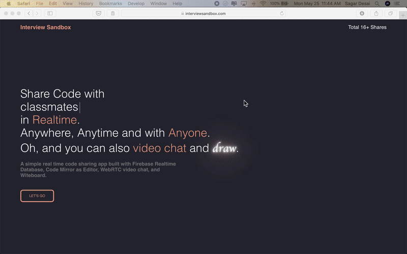

#  Interview Sandbox

Live app: http://interviewsandbox.com

An application that was inspired by the fact that interviews are meant to interactive, not only in the face to face and speaking sense, but also in that they're meant to provide you a chance to show your thinking process. I sought out to build an application that lets interviewers outline their code, as well as leverage a whiteboard to show their solutions to the problem at hand.

## Stack

React, Firebase (realtime database), CodeMirror for the text editor, WebRTC & sockets for video chat, and Witeboard integration. There are a couple bugs and some features still being built, namely the termainl output, which will use the Judge0 API.

If you're using the app and need to reference your code/drawings later, just save the link!

## Available Scripts

In the project directory, you can run

### `npm install` to install the app

### `npm run start` to run the app locally

### `npm run build` to get the app ready to deploy

I deployed it to Firebase, but you can deploy elsewhere as well.

If you have any issues/bugs, please create an issue on GH!

Cheers,

Sagar
